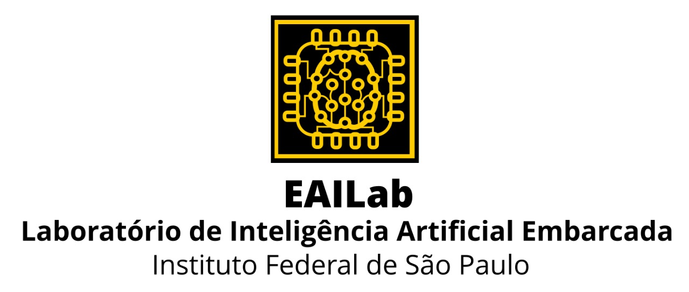

# Algoritmos de IA/ML
Repositório de exemplos de algoritmos de IA e ML reunidos pelos pesquisadores do EAILAB para servirem de referência e modelo para futuros projetos.

# Aproximação de Funções / Regressão
Rede Neural Artificial Clássica - (Artificial Neural Network - ANN) (Feed-Forward)

# Séries Temporais
Rede Neural Recorrente - Recurrent Neural Network - RNN)

Memória de Curto-Longo Prazo (Long Short Term Memory - LSTM)

Unidades Recorrentes Fechadas (Gated Recurrent Unit - GRU)

# Classificação de Imagens
Rede Neural Convolucional - Convolutional Neural Network - CNN)

# Algoritmos de Aprenizagem Por Reforço
Q-Learning
